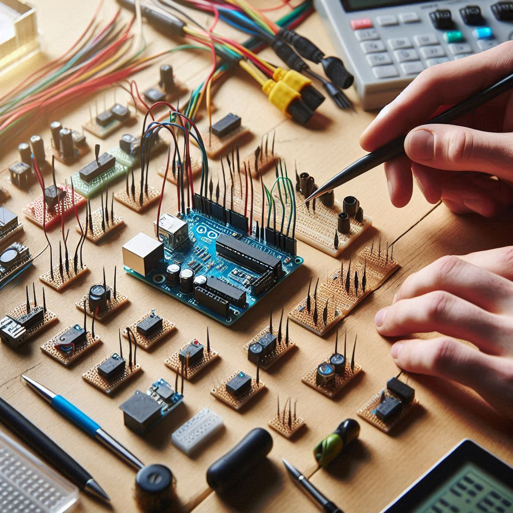

    

-------

  

# Projeto artigo técnico feito con IA's

 > ℹ️ **NOTE:** Este é o repositório desenvolvido durante o bootcamp Santander da [DIO](https://dio.me).

Projeto com o objetivo de gerar um artigo técnico com um layout rico, leitura agradável e com foco em promover sua autoridade técnica.

<!--a href="https://web.dio.me/articles/diretivas-estruturais-versus-diretivas-de-atributo-qual-usar-no-angular?back=%2Farticles&page=1&order=oldest#state=044ab194-1e3a-4b8e-95fe-c0f6b3b5260e&session_state=efdc9591-d6fe-4d79-ae97-e58af45061da&code=5ac231e4-c722-46c3-bb7f-32ce5363fb78.efdc9591-d6fe-4d79-ae97-e58af45061da.a889d5a2-0d02-46df-83a5-28a1b4ac39ab" title="View PDF now"> 📕Clique aqui para ler o artigo</a-->

## 💻 Tecnologias utilizadas no projeto

- [ChatGPT](https://chat.openai.com/) - para título e conteúdo
- [Microsoft Designer](https://designer.microsoft.com) - para gerar imagens

## 📄 Prompts e ferramentas

ChatGPT：

|   Ação   | prompt                                                                                                                                                                                                                                                                         |
| :------: | ------------------------------------------------------------------------------------------------------------------------------------------------------------------------------------------------------------------------------------------------------------------------------ |
|  título  | Crie um título sobre uso de arduíno e tecnologias de prototipagem.                                                                                                                                                                                                    |
| conteúdo | Faça um texto descrevendo o uso de arduíno, sensores, impressão 3d em prototipagens, será uma publicação de artigo em site, logo, deverá ser enxuta, precisa e concisa |

Microsoft Designer：

- No Designer, com a ferramenta de geração de imagens com prompt's, foram geradas as imagens utilizadas no artigo.

## ✨ Features

- Conteúdo gerado via ChatGPT
- Imagens geradas via Designer (Microsoft)

## 📚 Materiais

- prompts utilizados

## Escrivão

    
&nbsp&nbsp&nbspAdrian D. Piveta 
    &nbsp&nbsp&nbsp
    <a href="https://github.com/adrianpiveta">
    GitHub</a>&nbsp;|&nbsp;
    &nbsp;|&nbsp;
    <a href="https://www.instagram.com/adrian.piveta">
    Instagram</a>
&nbsp;|&nbsp;

  

---